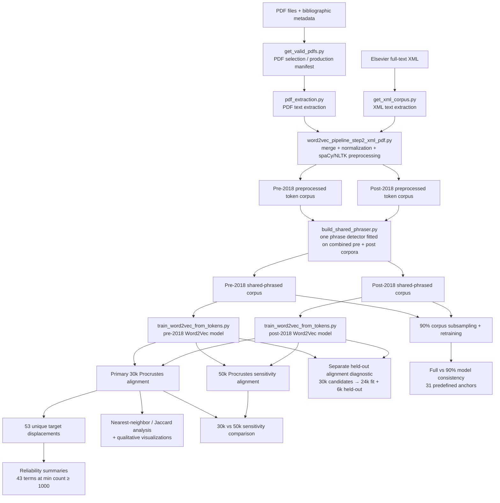

# Dental materials diachronic Word2Vec analysis

Repository accompanying the manuscript **“Mapping temporal evolution of structure–property concepts in dental materials literature using word embeddings.”**

This repository is organized around the **actual analysis path used for the manuscript**, rather than around a parallel demonstration implementation. It separates production pipeline code, downstream analyses, robustness checks, retrospective audits, preserved run metadata, and validation tests.

## What this repository contains

- corpus selection, XML/PDF extraction, and scientific-text preprocessing code;
- the shared phrase-detection stage used for both time periods;
- deterministic Word2Vec training code;
- orthogonal Procrustes alignment, displacement, nearest-neighbor/Jaccard, and visualization code;
- 90%-corpus consistency analysis;
- retrospective corpus-provenance, deduplication, journal-statistics, and 4Y/5Y terminology audits;
- preserved configuration/summary files from the manuscript runs;
- smoke, miniature end-to-end, and real-output regression validation tests.

The full article corpus is **not distributed** because it contains copyrighted and subscription-access full text. The repository therefore supports four complementary levels of inspection/reproduction:

1. **Inspectable synthetic intermediates** — `examples/fixtures/` + `examples/build_inspectable_examples.py` exercise the actual code path without article text.
2. **Derived manuscript-output inspection** — `examples/manuscript_output_snapshots/` contains compact actual quantitative outputs but no full text.
3. **Repository validation without the private corpus** — `validation/`.
4. **Downstream or full rebuilding** from prepared corpora/models or lawful local XML/PDF sources.

See [`docs/DATA_FLOW.md`](docs/DATA_FLOW.md) for the exact stage-by-stage data flow and the distinction between production code and retrospective audits.

---

## Repository layout

```text
configs/
    target_terms.tsv
    visualization_terms.tsv
    anchor_terms_consistency.txt

scripts/
    corpus/         source selection, extraction, merge, preprocessing
    modeling/       shared phrase detector and Word2Vec training
    analysis/       Procrustes, displacement, Jaccard, visualizations
    robustness/     90%-corpus sampling and consistency analysis

audits/
    corpus/         provenance, extraction, deduplication audits
    journals/       canonical journal-level reconstruction
    terminology/    4Y/5Y notation-emergence audit

run_metadata/       preserved manuscript-run configs and summary outputs
validation/         smoke, miniature E2E, and real-output regression tests
examples/           synthetic inspectable intermediates + actual derived output snapshots
tests/              focused unit tests
```

`audits/` contains **retrospective verification code**. These scripts were used to verify provenance or manuscript claims during revision; they are not part of the model-training path.

---

## Environment

The manuscript models were trained deterministically with a fixed seed and one Word2Vec worker. The preserved run configurations are in `run_metadata/`.

Install Python dependencies:

```bash
python -m pip install -r requirements.txt
python -m spacy download en_core_web_sm
python - <<'PY'
import nltk
nltk.download("stopwords")
PY
```

For the closest deterministic reproduction, set the Python hash seed before launching Python:

```bash
export PYTHONHASHSEED=42
```

### Canonical Word2Vec settings

The manuscript models used:

```text
architecture   skip-gram (sg=1)
vector_size    200
window         8
min_count      20
epochs         15
sample         1e-4
negative       15
alpha          0.025
min_alpha      0.0005
seed           42
workers        1
```

**Do not rely on CLI defaults when reproducing the manuscript models.** Use the explicit commands below or the preserved JSON files in `run_metadata/`.

The shared phrase detector used `min_count=30` and `threshold=10.0` and was trained once on the combined pre/post preprocessed corpora, then applied unchanged to both periods.

---

## Periods and corpus sizes

The operational periods used in the manuscript are:

- **pre-2018:** 1992–2017;
- **post-2018:** 2018–May 2026.

Verified source-record counts are:

```text
pre-2018:   96,150 records = 50,224 XML + 45,926 PDF
post-2018:  69,195 records = 36,988 XML + 32,207 PDF
```

After shared phrase detection, the training corpora contained:

```text
pre-2018:   234,184,910 tokens
post-2018:  260,521,379 tokens
```

The corresponding Word2Vec vocabularies contained 256,119 and 278,189 terms after `min_count=20` filtering.

---

## Pipeline overview




Retrospective provenance, deduplication, journal-statistics, and terminology audits are maintained under [`audits/`](audits/) and are not part of the model-training path. Detailed inputs, outputs, and provenance status for every stage are documented in [`docs/DATA_FLOW.md`](docs/DATA_FLOW.md).

---

### PDF extraction

The canonical manuscript pipeline uses `pymupdf_columns` as the primary
PDF extraction backend, with `pypdf` as a fallback when extraction with
`pymupdf_columns` is unavailable or unsuccessful.

`pypdf` remains available as a standalone backend for explicit use.

---

## Inspectable intermediate outputs

Reviewer-facing, redistributable examples are under [`examples/`](examples/). The source fixtures are synthetic and contain no manuscript article text. To regenerate every demonstration intermediate with the repository's actual extraction/preprocessing/modeling/analysis code:

```bash
python examples/build_inspectable_examples.py
```

This writes a numbered, inspectable chain:

```text
01_sources_and_extraction/
02_preprocessing/
03_shared_phrases/
04_word2vec/
05_procrustes/
06_semantic_evidence/
reports/
MANIFEST.json
```

The miniature example deliberately uses scaled-down modeling parameters; its numeric results are **not manuscript results**. Actual non-full-text derived outputs from the manuscript models are separately preserved in [`examples/manuscript_output_snapshots/`](examples/manuscript_output_snapshots/), including the 53-term displacement table, held-out Procrustes diagnostic, 30k/50k sensitivity, common-vocabulary nearest-neighbor/Jaccard results, and the final 31-anchor consistency summary.


## Canonical modeling commands

The commands below assume the period-specific **preprocessed JSON token corpora** already exist. Paths match the preserved manuscript-run metadata.

### 1. Train one shared phrase detector and apply it to both periods

```bash
python scripts/modeling/build_shared_phraser.py \
  --input-corpora \
    outputs_after2018_xml_pdf/corpora/matsci_post2018_seed42.preprocessed.json \
    outputs_1992_2017_xml_pdf/corpora/matsci_pre2018_seed42.preprocessed.json \
  --output-corpora \
    outputs_shared/matsci_post2018_seed42.shared_phrased.json \
    outputs_shared/matsci_pre2018_seed42.shared_phrased.json \
  --phraser-path outputs_shared/matsci_pre_post_shared_bigram.phraser \
  --phrase-min-count 30 \
  --phrase-threshold 10.0 \
  --max-vocab-size 40000000 \
  --top-phrases-csv outputs_shared/matsci_pre_post_shared_bigram.top_phrases.csv \
  --summary-json outputs_shared/matsci_pre_post_shared_bigram.summary.json
```

### 2. Train the two manuscript Word2Vec models

Pre-2018:

```bash
PYTHONHASHSEED=42 python scripts/modeling/train_word2vec_from_tokens.py \
  --corpus outputs_shared/matsci_pre2018_seed42.shared_phrased.json \
  --model-path outputs_models/matsci_pre2018_sharedphrases.model \
  --vocab-path outputs_models/matsci_pre2018_sharedphrases.vocab.csv \
  --config-path outputs_models/matsci_pre2018_sharedphrases.config.json \
  --seed 42 --deterministic --skip-gram \
  --vector-size 200 --window 8 --min-count 20 --epochs 15 \
  --sample 1e-4 --negative 15 --alpha 0.025 --min-alpha 0.0005
```

Post-2018:

```bash
PYTHONHASHSEED=42 python scripts/modeling/train_word2vec_from_tokens.py \
  --corpus outputs_shared/matsci_post2018_seed42.shared_phrased.json \
  --model-path outputs_models/matsci_post2018_sharedphrases.model \
  --vocab-path outputs_models/matsci_post2018_sharedphrases.vocab.csv \
  --config-path outputs_models/matsci_post2018_sharedphrases.config.json \
  --seed 42 --deterministic --skip-gram \
  --vector-size 200 --window 8 --min-count 20 --epochs 15 \
  --sample 1e-4 --negative 15 --alpha 0.025 --min-alpha 0.0005
```

### 3. Primary 30k Procrustes displacement

```bash
python scripts/analysis/procrustes_displacement.py \
  --pre-model outputs_models/matsci_pre2018_sharedphrases.model \
  --post-model outputs_models/matsci_post2018_sharedphrases.model \
  --target-terms configs/target_terms.tsv \
  --out-dir outputs_procrustes_30000 \
  --min-count 100 \
  --top-n 30000
```

`configs/target_terms.tsv` contains **56 material-system memberships / 53 unique target terms**. Terms shared by two material systems are represented in both groups but receive only one scientific displacement value per unique term.

### 4. 50k alignment-vocabulary sensitivity

```bash
python scripts/analysis/procrustes_displacement.py \
  --pre-model outputs_models/matsci_pre2018_sharedphrases.model \
  --post-model outputs_models/matsci_post2018_sharedphrases.model \
  --target-terms configs/target_terms.tsv \
  --out-dir outputs_procrustes_50000 \
  --min-count 100 \
  --top-n 50000

python scripts/analysis/calculate_procrustes_sensitivity.py \
  --displacement-30k outputs_procrustes_30000/cosine_displacement.csv \
  --displacement-50k outputs_procrustes_50000/cosine_displacement.csv \
  --output-csv outputs_procrustes_methods/procrustes_30k_50k_sensitivity.csv
```

The canonical unique-term comparison gives Pearson `r = 0.99819` and Spearman `rho = 0.99282` (reported as 0.998 and 0.993).

### 5. Held-out alignment diagnostic

```bash
python scripts/analysis/procrustes_diagnostic.py \
  --pre-model outputs_models/matsci_pre2018_sharedphrases.model \
  --post-model outputs_models/matsci_post2018_sharedphrases.model \
  --target-terms configs/target_terms.tsv \
  --out-dir outputs_procrustes_diagnostic \
  --min-count 100 \
  --top-n 30000
```

The diagnostic splits the 30,000 eligible background terms reproducibly into 24,000 fitting terms and 6,000 held-out terms (`random_state=42`). This diagnostic transform is separate from the primary 30k transform used for target displacement.

### 6. Reliability and material-system summaries

```bash
python scripts/analysis/calculate_procrustes_summary.py \
  --displacement-csv outputs_procrustes_30000/cosine_displacement.csv \
  --target-terms configs/target_terms.tsv \
  --out-dir outputs_procrustes_methods \
  --reliable-min-count 1000
```

The canonical global analysis contains 53 unique paired target terms; 43 meet `min(pre_count, post_count) >= 1000`.

### 7. Nearest-neighbor/Jaccard analysis and visualization outputs

```bash
python scripts/analysis/semantic_shift_evidence.py \
  --pre-model outputs_models/matsci_pre2018_sharedphrases.model \
  --post-model outputs_models/matsci_post2018_sharedphrases.model \
  --target-terms configs/target_terms.tsv \
  --visualization-terms configs/visualization_terms.tsv \
  --alignment-npz outputs_procrustes_30000/procrustes_alignment.npz \
  --out-dir outputs_semantic_shift \
  --k 5 10 20 \
  --nn-topn 20
```

The visualization list intentionally contains selected contextual/emergence terms in addition to canonical quantitative targets. Those extra visualization-only terms are not included in quantitative displacement summaries.

### 8. 90%-corpus consistency models

```bash
PYTHONHASHSEED=42 python scripts/robustness/sample90_and_train_word2vec.py \
  --input-corpora \
    outputs_shared/matsci_pre2018_seed42.shared_phrased.json \
    outputs_shared/matsci_post2018_seed42.shared_phrased.json \
  --labels pre2018 post2018 \
  --output-dir outputs_consistency_90pct \
  --fraction 0.90 \
  --seed 42 \
  --seed-offset-per-corpus 1000 \
  --deterministic --skip-gram \
  --vector-size 200 --window 8 --min-count 20 --epochs 15 \
  --sample 1e-4 --negative 15 --alpha 0.025 --min-alpha 0.0005

python scripts/robustness/compare_word2vec_consistency.py \
  --full-models \
    outputs_models/matsci_pre2018_sharedphrases.model \
    outputs_models/matsci_post2018_sharedphrases.model \
  --sample-models \
    outputs_consistency_90pct/models/pre2018_fraction0.90_seed42.model \
    outputs_consistency_90pct/models/post2018_fraction0.90_seed1042.model \
  --labels pre2018 post2018 \
  --anchor-file configs/anchor_terms_consistency.txt \
  --out-dir outputs_consistency_90pct/evaluation_31anchors \
  --top-k 10 20 \
  --expand-neighbors 20
```

The anchor file contains 31 predefined terms. Anchors absent from either paired model are excluded from that period's quantitative consistency metrics.

---

## Source selection and preprocessing

The full source paths are environment-specific and are therefore not hard-coded in the repository. Users with access to the source collection can inspect the CLIs with:

```bash
python scripts/corpus/get_valid_pdfs.py --help
python scripts/corpus/get_xml_corpus.py --help
python scripts/corpus/word2vec_pipeline_step2_xml_pdf.py --help
```

The manuscript preprocessing path uses the period-specific selected PDF records together with the extracted XML raw corpus to produce `*.preprocessed.json` token corpora. `word2vec_pipeline_step2_xml_pdf.py` is used here for **source merge and preprocessing**; the manuscript phrase detection and final Word2Vec training are performed by the dedicated scripts in `scripts/modeling/` so that one shared phrase detector is applied to both periods.

PDF production selection/extraction and XML provenance are not identical in how their source-record manifests were preserved. PDF source selection was recorded in production JSONL manifests. XML source-record manifests were reconstructed retrospectively during the reproducibility audit from the preserved XML sources using the original extraction logic. See `audits/corpus/` and `docs/DATA_FLOW.md`.

---

## Historical metadata versus canonical analysis configuration

`run_metadata/procrustes_metadata_30000.json` and `run_metadata/procrustes_metadata_50000.json` are preserved historical run artifacts. Their original target input produced 57 output rows: the 56 material-system memberships plus `everx_flow`, which was absent from the pre-2018 vocabulary and therefore had no paired displacement.

The current canonical quantitative configuration is `configs/target_terms.tsv`: 56 memberships / 53 unique paired-analysis terms. `everx_flow` is retained only where appropriate for descriptive vocabulary-emergence/visualization analyses. Because it was not present in the shared pre/post vocabulary, removing it from the canonical paired target list does not change the eligible shared Procrustes background vocabulary.

---

## Validation

The restructured repository has been validated at three levels:

```bash
python validation/run_smoke_test.py
python validation/run_mini_e2e.py
python validation/run_regression_test.py
```

All three tests passed in the project-server environment. The miniature E2E test exercised the production spaCy/NLTK preprocessing path. The regression test reproduced the canonical downstream statistics from preserved real outputs **without retraining the manuscript models**.

Key regression checks include:

```text
53 unique paired targets; 43 reliability-filtered targets
30k vs 50k: Pearson r = 0.9981916; Spearman rho = 0.9928237
held-out diagnostic: 24,000 fit / 6,000 held-out; top-1 = 0.883
90% consistency: pre-2018 27/31 anchors; post-2018 31/31 anchors
```

See [`validation/VALIDATION_REPORT.md`](validation/VALIDATION_REPORT.md) for details.

---

## Retrospective audits

The `audits/` directory records revision-stage verification work and is intentionally kept separate from model training. It includes:

- XML source/content provenance reconstruction;
- PDF year provenance checks;
- XML/PDF overlap and exact-PDF duplicate audits;
- extraction-quality comparisons;
- canonical journal-title/count reconstruction;
- strict/ambiguous/excluded matching for 4Y/5Y zirconia notation.

These scripts provide traceability for manuscript claims but should not be interpreted as stages that generated the original Word2Vec models.

---

## Data availability

The repository does not redistribute the complete source corpus because the collection includes copyrighted and subscription-access article full text. Source-selection metadata, run configuration summaries, code, validation fixtures, and derived non-copyrighted outputs can be distributed where licensing permits.

The validation mini-corpus is synthetic and is intended only to demonstrate executable data flow and file formats; it is not a substitute for the full scientific corpus.

---

## Important interpretation note

Word2Vec cosine similarity and aligned-vector displacement represent **contextual association in the literature**, not causal, directional, or monotonic material-property relationships. Two-dimensional PCA/t-SNE/UMAP outputs are exploratory visualizations; quantitative temporal comparisons are performed in the aligned high-dimensional embedding space.

---

## Reproducibility package

The reproduction bundle provides a fixed snapshot of the code, configuration, validation utilities, inspectable examples, and environment metadata corresponding to the submitted manuscript version.

`reproduction/` separates four levels of reproducibility: a public synthetic end-to-end demonstration, regression verification of preserved manuscript-derived outputs without model retraining, downstream reanalysis from preserved trained models, and full local reconstruction from non-redistributable preprocessed/full-text corpora. See `reproduction/README.md` and `reproduction/REPRODUCIBILITY_MATRIX.md`.

After the inspectable example has been generated and validation passes, create the checksummed archival bundle with:

```bash
python3 reproduction/build_reproduction_bundle.py
```

## AI-assisted development

ChatGPT (OpenAI) was used during manuscript revision to assist with code review and
refactoring, development of validation and reproducibility utilities, documentation,
and language editing. AI-generated or AI-assisted code was reviewed and edited by the
authors before use. Reported computational outputs were obtained by executing the
resulting code and were checked using the validation and reproducibility procedures
included in this repository.